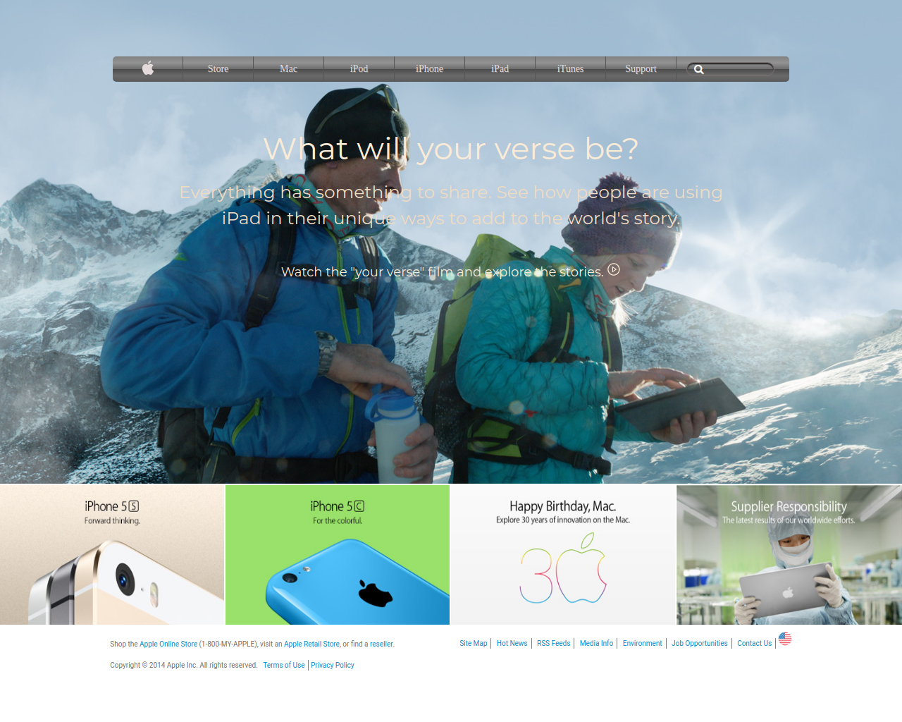

# Project Name
# Building-with-Backgrounds-and-Gradients
> This project is part of Microverse HTML/CSS curriculum

The project is the fourth of the Microverse curriculum HTML/CSS module. 
Project mirrors the old Apple.com page style with using images as background and linear gradient designed navigation.
See the source page below:
[Source page Link](https://web.archive.org/web/20140301004610/http://www.apple.com/)

## Built With

- HTML/CSS/SCSS
- Fontawesome library
- Iconify library
- Colorzilla CSS Gradients Generator

## Live Demo

[Live Demo Link](https://livedemo.com)

## Getting Started

To get a local copy up and running follow these simple example steps.

### Prerequisites
- Any PC or device with internet connection and ability to use command line terminal
### Setup
- Open the command line terminal
### Install
- Go to your preferred directory
- Run [ git clone https://github.com/Arinpe/Building-with-Backgrounds-and-Gradients.git ] command
### Usage
- Open index.html file in any modern browser
### Run tests
- Tests passed can be found here (https://github.com/Arinpe/Building-with-Backgrounds-and-Gradients/pulls)
### Deployment
- Page deployed through the Github pages service and can be viewed through the Live Demo Link (see above)

## Authors

👤 **Igors Oleinikovs**

- GitHub: [@Igors78](https://github.com/Igors78)
- Twitter: [@oleinikovs](https://twitter.com/oleinikovs)
- LinkedIn: [LinkedIn](https://www.linkedin.com/in/igors-oleinikovs-17a10958/)

👤 **Adesuyi Adetola**

- GitHub: [@Arinpe](https://github.com/Arinpe)
- Twitter: [@_detola_](https://twitter.com/_detola_)
- LinkedIn: [Adesuyi Adetola](https://www.linkedin.com/in/adesuyi-adetola-7b4451111/)

## 🤝 Contributing

Contributions, issues, and feature requests are welcome!

Feel free to check the [issues page](https://github.com/Arinpe/Building-with-Backgrounds-and-Gradients/issues).

## Show your support

Give a ⭐️ if you like this project!

## Acknowledgments

- Hat tip to anyone whose code was used
- Thanks to Colorzilla by making designing easier
- Thanks to stand-up team for raising issues and giving constructive critics out

## 📝 License

This project is [MIT](lic.url) licensed.